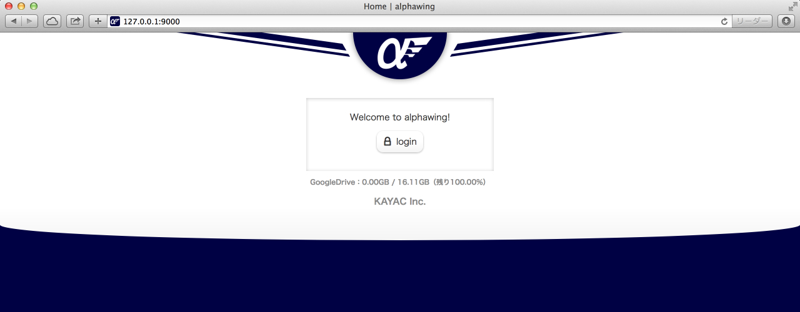

alphawing
=========


alphawing is a [TestFlight](https://www.testflightapp.com/)-like application for Android.

## Getting Started

### Setup Revel

``` sh
$ go get github.com/revel/revel
$ go get github.com/revel/cmd/revel
```

### Get alphawing

``` sh
$ go get github.com/kayac/alphawing/app
```

### Decide domain name for the application

ex. `example.com`

Because you have to enter the callback URL for Google OAuth in the next step.

### Setup new project on Google Developers Console

alphawing uses the Google OAuth for login authentication, and the Google Drive API for APK file management.

#### Create a new project


1. Go to the [Google Developers Console](https://console.developers.google.com).
2. Create a new project.

#### Enable to use the Google Drive API

1. Select the project.
2. In the sidebar, select **APIs** in **APIS & AUTH** section.
3. Make sure the status is **ON** for the **Drive API**.

#### Create new client IDs

1. Select the project.
2. In the sidebar, select **Credentials** in **APIS & AUTH** section.

##### Service account

1. Select **Create New Client ID**.
2. Specify that your application type is **Service account**.
3. Select **Create Client ID**.
4. JSON key file will be downloaded automatically.

ref. https://developers.google.com/drive/web/service-accounts

##### Client ID for Web application

1. Select **Create New Client ID**.
2. Choose **Web application**.
3. Enter the **AUTHORIZED REDIRECT URI** (ex. `http://example.com/callback`)
4. Select **Create Client ID**.

### Get the aapt command from Android SDK

alphawing uses the aapt command in order to parse APK file.
The aapt binary is included in the ADT(Android Developer Tools).
So, you have to download the ADT from [here](http://developer.android.com/sdk/index.html).

### Create database

You have to create database if you want to use the MySQL database or the SQLite single-file database.
(alphawing uses the SQLite in-memory database in the dev run mode by default.)

``` sql
CREATE DATABASE `alphawing` DEFAULT CHARACTER SET `utf8`;
```

### Edit config file

``` sh
$ cd $GOPATH/src/github.com/kayac/alphawing
$ cp conf/app.conf.sample conf/app.conf
```

You have to edit the following settings in `conf/app.conf`.

ref. http://revel.github.io/manual/appconf.html

|name|description|
|:---|:---|
|app.secret|Your original random string.<br />It is used for cryptographic operations. Revel also uses it internally to sign session cookies.|
|app.permitteddomain|The domain part of email. (comma separated list)<br />Users whose email includes the domain part listed in this section are permitted to access alphawing. You can't use wild-card matching or partial matching.|
|app.organizationname|Your orgaization name.|
|db.import|The import path of `database/sql` driver you use.|
|db.driver|The name of the `database/sql` driver.|
|db.spec|The data source name of your `database/sql` database.<br />ex. `user:password@tcp(localhost:3306)/alphawing?loc=Local&parseTime=true`|
|google.webapplication.clientid|**CLIENT ID** for your web application created in Google Developers Console.|
|google.webapplication.clientsecret|**CLIENT SECRET** for your web application created in Google Developers Console.|
|google.webapplication.callbackurl|**REDIRECT URIS** for your web application created in Google Developers Console.|
|google.serviceaccount.keypath|The path to your service account's JSON key file.|
|aapt.path|The path to the aapt command.|

### Run the application

``` sh
$ revel build github.com/kayac/alphawing /path/to/build/output/folder
$ /path/to/build/output/folder/run.sh
```

ref. http://revel.github.io/manual/deployment.html



## Document

* [API document](docs/api.md)

## Customize

* [View](docs/view_customize.md)

## License

Copyright 2014 KAYAC Inc.

Licensed under the Apache License, Version 2.0 (the "License"); you may not use this file except in compliance with the License.
You may obtain a copy of the License at

http://www.apache.org/licenses/LICENSE-2.0

Unless required by applicable law or agreed to in writing, software distributed under the License is distributed on an "AS IS" BASIS, WITHOUT WARRANTIES OR CONDITIONS OF ANY KIND, either express or implied.
See the License for the specific language governing permissions and limitations under the License.
